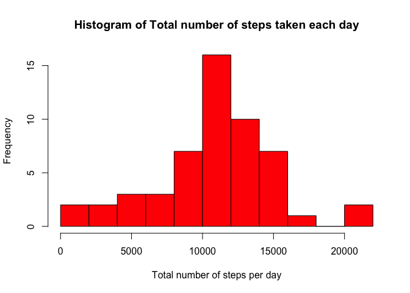
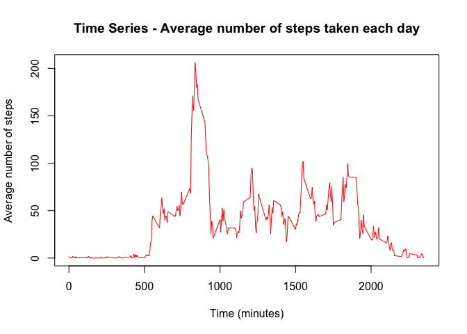
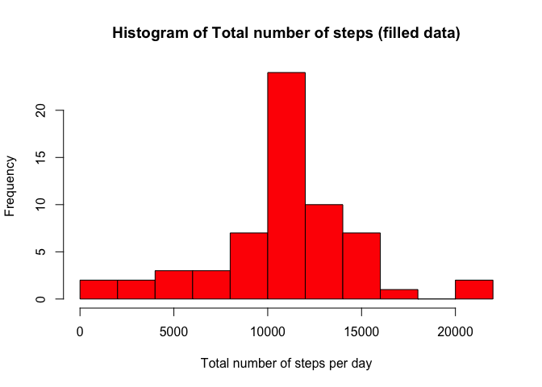
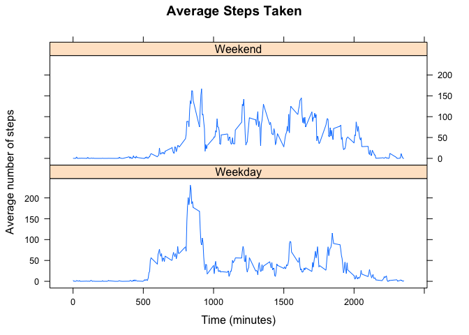

# Reproducible Research: Peer Assessment 1
**Mercia Costa e Silva** (February 2016)

## Loading and preprocessing the data

1. Load the data (i.e. 𝚛𝚎𝚊𝚍.𝚌𝚜𝚟())


```r
# load data
data_orig <- read.csv('activity.csv')
head(data_orig,5)
```

```
##   steps       date interval
## 1    NA 2012-10-01        0
## 2    NA 2012-10-01        5
## 3    NA 2012-10-01       10
## 4    NA 2012-10-01       15
## 5    NA 2012-10-01       20
```

2. Process/transform the data (if necessary) into a format suitable for your analysis


```r
# Convert date as date
data_orig$date <- as.Date(data_orig$date)
summary(data_orig)
```

```
##      steps             date               interval     
##  Min.   :  0.00   Min.   :2012-10-01   Min.   :   0.0  
##  1st Qu.:  0.00   1st Qu.:2012-10-16   1st Qu.: 588.8  
##  Median :  0.00   Median :2012-10-31   Median :1177.5  
##  Mean   : 37.38   Mean   :2012-10-31   Mean   :1177.5  
##  3rd Qu.: 12.00   3rd Qu.:2012-11-15   3rd Qu.:1766.2  
##  Max.   :806.00   Max.   :2012-11-30   Max.   :2355.0  
##  NA's   :2304
```

```r
# remove empty observations
data_clean <- data_orig[complete.cases(data_orig),]
summary(data_clean)
```

```
##      steps             date               interval     
##  Min.   :  0.00   Min.   :2012-10-02   Min.   :   0.0  
##  1st Qu.:  0.00   1st Qu.:2012-10-16   1st Qu.: 588.8  
##  Median :  0.00   Median :2012-10-29   Median :1177.5  
##  Mean   : 37.38   Mean   :2012-10-30   Mean   :1177.5  
##  3rd Qu.: 12.00   3rd Qu.:2012-11-16   3rd Qu.:1766.2  
##  Max.   :806.00   Max.   :2012-11-29   Max.   :2355.0
```


## What is mean total number of steps taken per day?

1. Calculate the total number of steps taken per day

```r
# sum of steps for each day
steps_sum <- aggregate(steps ~ date, data_clean, sum)
head(steps_sum,5)
```

```
##         date steps
## 1 2012-10-02   126
## 2 2012-10-03 11352
## 3 2012-10-04 12116
## 4 2012-10-05 13294
## 5 2012-10-06 15420
```

2. If you do not understand the difference between a histogram and a barplot, research the difference between them. Make a histogram of the total number of steps taken each day


```r
# plot
hist(steps_sum$steps, breaks=10, main='Histogram of Total number of steps taken each day', xlab='Total number of steps per day', col='red')
```

\

3. Calculate and report the mean and median of the total number of steps taken per day


```r
# Mean
mean_steps <- mean(steps_sum$steps)
mean_steps
```

```
## [1] 10766.19
```

```r
# Median
median_steps <- median(steps_sum$steps)
median_steps
```

```
## [1] 10765
```

## What is the average daily activity pattern?

1. Make a time series plot (i.e. 𝚝𝚢𝚙𝚎 = "𝚕") of the 5-minute interval (x-axis) and the average number of steps taken, averaged across all days (y-axis)


```r
# mean of steps for each 5min interval
avg_steps_5min <- aggregate(steps ~ interval, data_clean, mean)
head(avg_steps_5min,5)
```

```
##   interval     steps
## 1        0 1.7169811
## 2        5 0.3396226
## 3       10 0.1320755
## 4       15 0.1509434
## 5       20 0.0754717
```

```r
# plot
plot(avg_steps_5min$interval, avg_steps_5min$steps, type='l', col='red', main='Time Series - Average number of steps taken each day', xlab='Time (minutes)', ylab='Average number of steps')
```

\

2. Which 5-minute interval, on average across all the days in the dataset, contains the maximum number of steps?


```r
# locate the 5 min interval where the average step is maximum
max_5min <- avg_steps_5min[avg_steps_5min$steps==max(avg_steps_5min$steps),'interval']
max_5min
```

```
## [1] 835
```


## Imputing missing values

Note that there are a number of days/intervals where there are missing values (coded as 𝙽𝙰). The presence of missing days may introduce bias into some calculations or summaries of the data.

1. Calculate and report the total number of missing values in the dataset (i.e. the total number of rows with 𝙽𝙰s)


```r
# calculate the total number of missing values
total_na <- sum(is.na(data_orig))
total_na
```

```
## [1] 2304
```


2. Devise a strategy for filling in all of the missing values in the dataset. The strategy does not need to be sophisticated. For example, you could use the mean/median for that day, or the mean for that 5-minute interval, etc.

```
Strategy used here:
Fill the missing values with the step average value for the same interval.

Which means that when the step is a missing value (NA), check which time interval corresponds to this observation and change the step value to the average of this correspondent interval

```

3. Create a new dataset that is equal to the original dataset but with the missing data filled in.


```r
# data from original
data_filled <- data_orig

# substitute missing values for average of interval
for (i in 1:nrow(data_filled)) {
    if (is.na(data_filled[i,'steps'])) {
        data_filled[i,'steps']<- avg_steps_5min[avg_steps_5min$interval==data_filled[i,'interval'],'steps']
    }
}

head(data_filled,5)
```

```
##       steps       date interval
## 1 1.7169811 2012-10-01        0
## 2 0.3396226 2012-10-01        5
## 3 0.1320755 2012-10-01       10
## 4 0.1509434 2012-10-01       15
## 5 0.0754717 2012-10-01       20
```

4. Make a histogram of the total number of steps taken each day and Calculate and report the mean and median total number of steps taken per day. Do these values differ from the estimates from the first part of the assignment? What is the impact of imputing missing data on the estimates of the total daily number of steps?


```r
# sum of steps for each data with the data filled
steps_sum_filled <- aggregate(steps ~ date, data_filled, sum)

# plot
hist(steps_sum_filled$steps, breaks=10, main='Histogram of Total number of steps (filled data)', xlab='Total number of steps per day', col='red')
```

\

```r
# Mean - with filled data
mean_steps_filled <- mean(steps_sum_filled$steps)
mean_steps_filled
```

```
## [1] 10766.19
```

```r
# Median - with filled data
median_steps_filled <- median(steps_sum_filled$steps)
median_steps_filled
```

```
## [1] 10766.19
```

```
The missing data doesn't seem to cause much difference in the mean value, median value and histagram - the differences are minimal.
From this we may conclude that it is safe to perform the analysis with the clean data.
```


## Are there differences in activity patterns between weekdays and weekends?

For this part the 𝚠𝚎𝚎𝚔𝚍𝚊𝚢𝚜() function may be of some help here. Use the dataset with the filled-in missing values for this part.

1. Create a new factor variable in the dataset with two levels – “weekday” and “weekend” indicating whether a given date is a weekday or weekend day.


```r
# data copied from filled data
data_days <- data_filled

# add day of the week
data_days$day <- weekdays(data_days$date)

# weekend and weekdays
for (i in 1:nrow(data_days)) {
    if (data_days[i,'day']=='Saturday' | data_days[i,'day']=='Sunday') {
        data_days[i,'day'] <- 'Weekend'
    }
    else {
        data_days[i,'day'] <- 'Weekday'
    }
}

# as a factor
data_days$day <- factor(data_days$day)

head(data_days,5)
```

```
##       steps       date interval     day
## 1 1.7169811 2012-10-01        0 Weekday
## 2 0.3396226 2012-10-01        5 Weekday
## 3 0.1320755 2012-10-01       10 Weekday
## 4 0.1509434 2012-10-01       15 Weekday
## 5 0.0754717 2012-10-01       20 Weekday
```

2. Make a panel plot containing a time series plot (i.e. 𝚝𝚢𝚙𝚎 = "𝚕") of the 5-minute interval (x-axis) and the average number of steps taken, averaged across all weekday days or weekend days (y-axis). See the README file in the GitHub repository to see an example of what this plot should look like using simulated data.


```r
library(lattice)

# average of steps for the time/date intervals
avg_steps_5min_day <- aggregate(steps ~ interval + day, data_days, mean)

# plot
xyplot(steps ~ interval | day, avg_steps_5min_day, type='l',layout=c(1,2),
       main='Average Steps Taken', xlab='Time (minutes)', ylab='Average number of steps')
```

\

